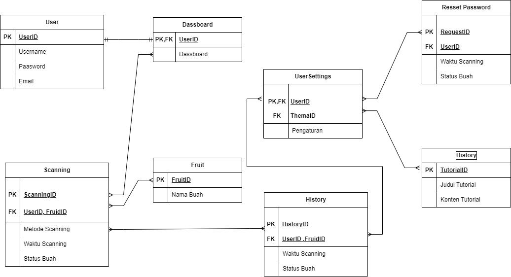
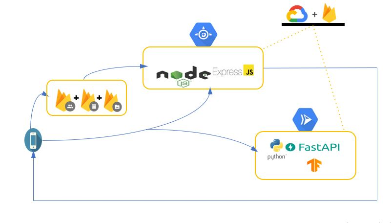
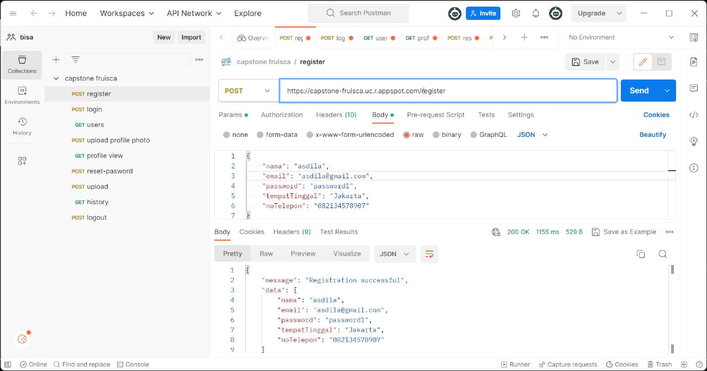
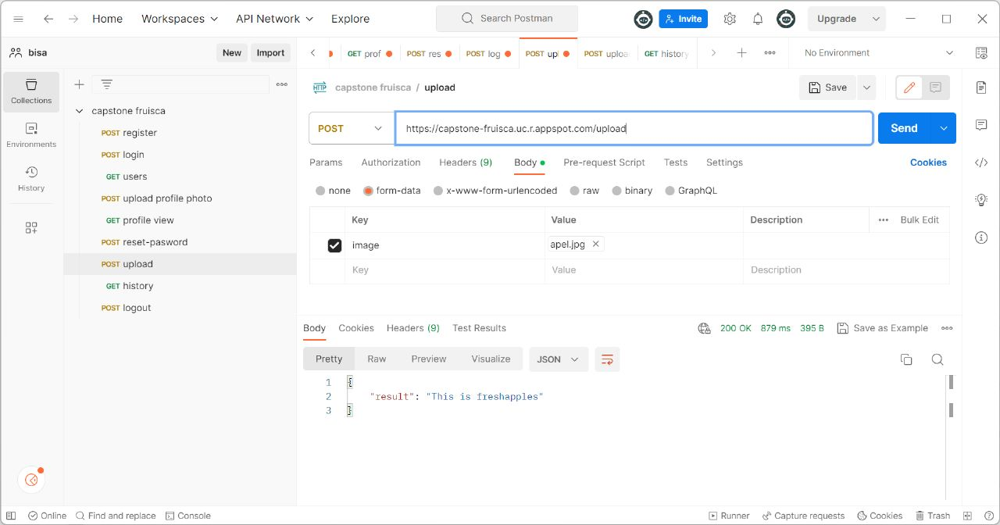

# Fruisca
Bangkit CAPSTONE project:  Fruisca: App for Checking Fruit Freshness
Capstone Team ID : C23 - PR549

# Cloud Computing Documentation

## Tools
Tools we use to do this project:
- [Google Cloud Platform](https://console.cloud.google.com)
- [Visual Studio Code](https://code.visualstudio.com)
- [FastAPI](https://fastapi.tiangolo.com)
- [Docker](https://www.docker.com)
- [Firebase](https://firebase.google.com)
- [Node.js](https://nodejs.org/en)
- [Postman](https://www.postman.com)

## Database system
here ERD for our Database:
our project using realtime database on firebase, the database will be integrated on android application using API bridge

  

## Project Cloud Architecture

  

We primarily use GCP to build API. We will use the Rest API and be hosted with the Firebase Realtime Database, authentication and storage on firebase and connected to the Google Cloud platform and deploy the API model that we built using App Engine, as well as deploy the machine learning model using cloud run

## Postman Documentation
our result after call API using Postman for Database:

  

our result after call API using Postman for Machine Learning Model:

  

